# lk_leopards

Catalogue of leopards observed in Kumana National Park, Sri Lanka.

## Summary

| Metric | Count |
| --- | --- |
| Total leopards | 88 |
| Males | 43 |
| Females | 45 |
| Zones | A, B, C |

## Top Similar Pairs — Same Leopard

The 10 image pairs with the highest cosine similarity score that belong to the *same* leopard.

| Score | Image A | Image B |
| --- | --- | --- |
| 0.8585 | 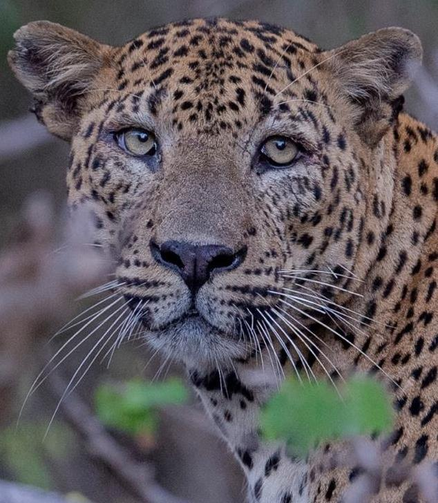 | 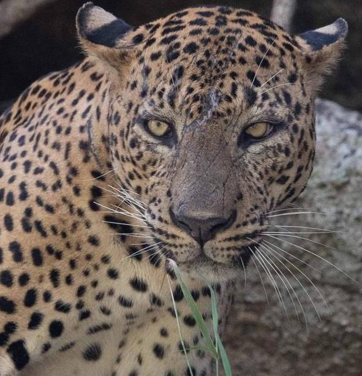 |
| 0.8058 | 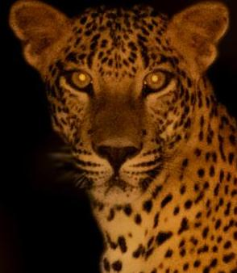 | 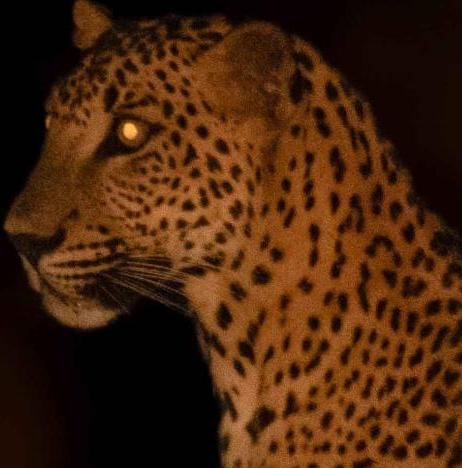 |
| 0.7883 | 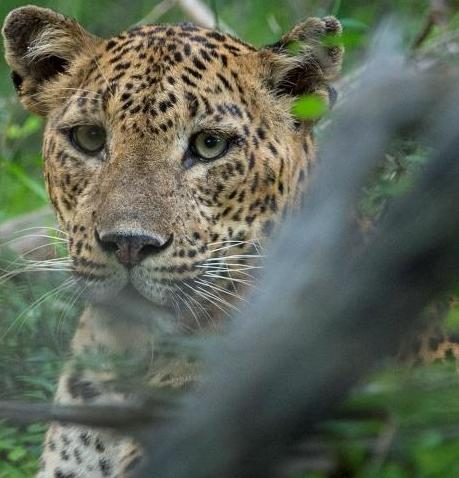 | 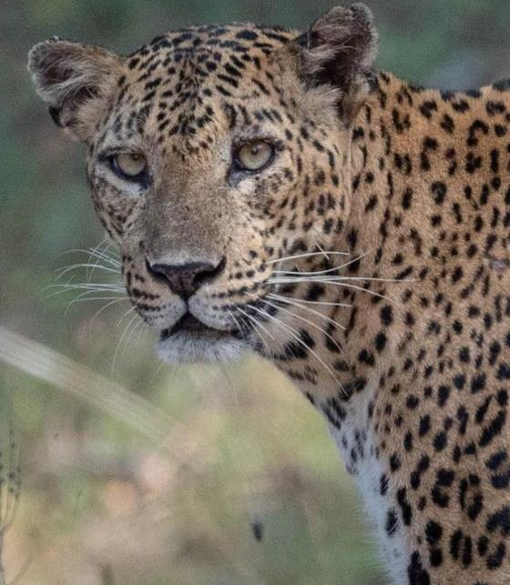 |
| 0.7386 | 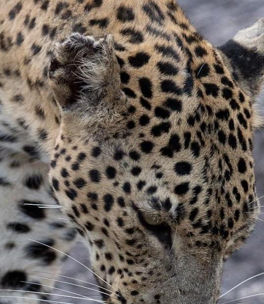 | 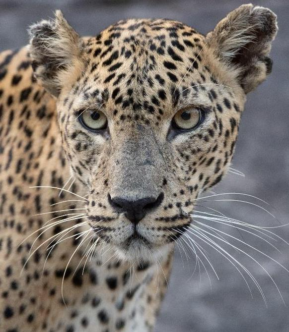 |

## Top Similar Pairs — Different Leopard

The 10 image pairs with the highest cosine similarity score that belong to *different* leopards.

| Score | Image A | Image B |
| --- | --- | --- |
| 0.9056 | 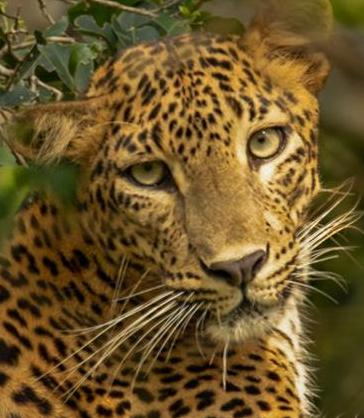 | 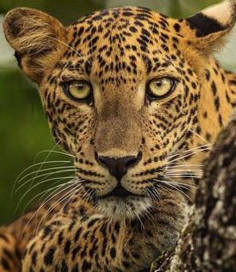 |
| 0.8983 | 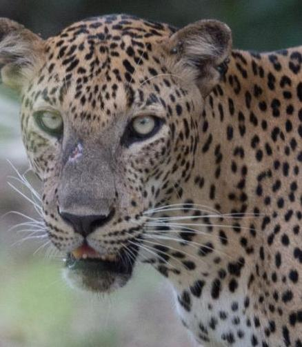 | 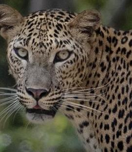 |
| 0.8770 | 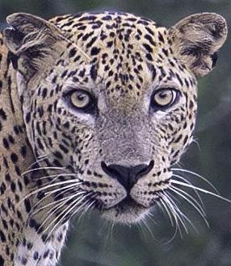 |  |
| 0.8755 | 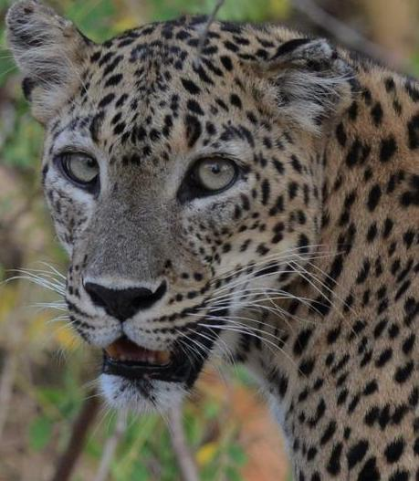 |  |
| 0.8747 |  |  |
| 0.8743 |  | 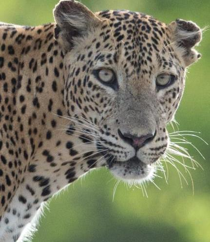 |
| 0.8742 |  | 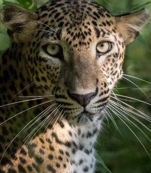 |
| 0.8737 | 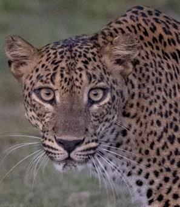 |  |
| 0.8702 |  |  |
| 0.8693 | 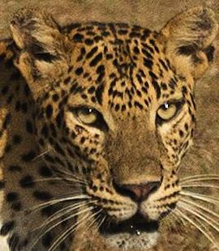 |  |

## Leopards

| ID | Name | Gender | Zone(s) | First Seen | Last Seen | Image |
| --- | --- | --- | --- | --- | --- | --- |
| KLF0001 | Raani | Female | B | 2019-11-15 | 2023-11-17 |  |
| KLF0002 | Villu | Female | B | 2019-03-25 | 2022-10-09 |  |
| KLF0003 | Devi | Female | B | 2018-06-24 | 2019-11-17 |  |
| KLF0004 | Neela | Female | B | 2019-03-25 | 2019-11-17 |  |
| KLF0005 | Leela | Female | A | 2014-11-** | 2025-03-22 |  |
| KLF0006 | Scent | Female | A | 2020-06-09 | 2025-05-06 |  |
| KLF0007 | Raki | Female | A, B | 2014-05-17 | 2025-04-18 |  |
| KLF0008 | Black Nose | Female | A | 2020 | 2025-05-10 |  |
| KLF0009 | Mitta | Female | A | 2021-01-19 | 2022-06-19 |  |
| KLF0010 | Ridhi | Female | B | 2019-05-01 | 2025-05-06 | 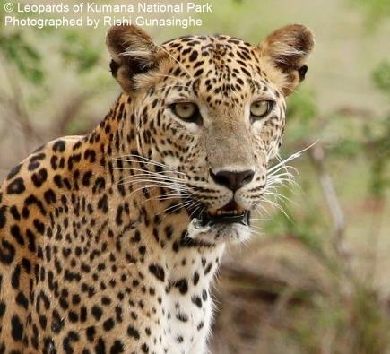 |
| KLF0011 | Khema | Female | B | 2019-03-25 | 2024-11-06 |  |
| KLF0012 | Sobi | Female | B | 2020-08-23 | 2024-10-27 |  |
| KLF0013 | Anodi | Female | B | 2021-06-26 | 2024-09-17 | 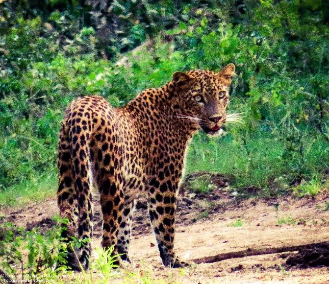 |
| KLF0014 | Kiso | Female | A | 2017-04-29 | 2017-04-29 | 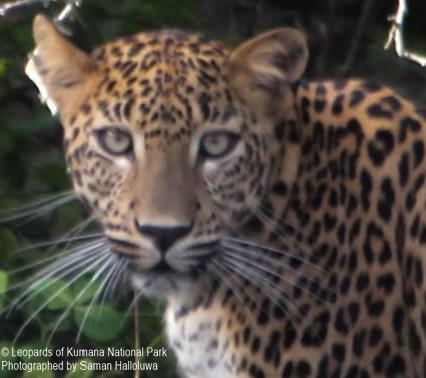 |
| KLF0015 | Bharani | Female | B | 2017-02-01 | 2024-10-23 | 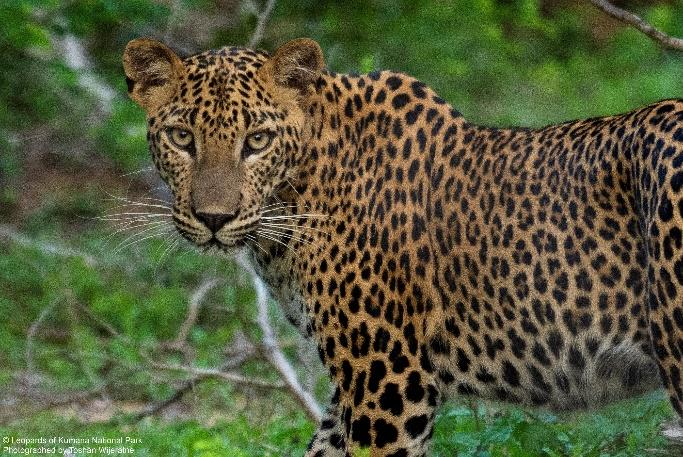 |
| KLF0016 | Ramani | Female | B | 2017-02-01 | 2017-11-17 | 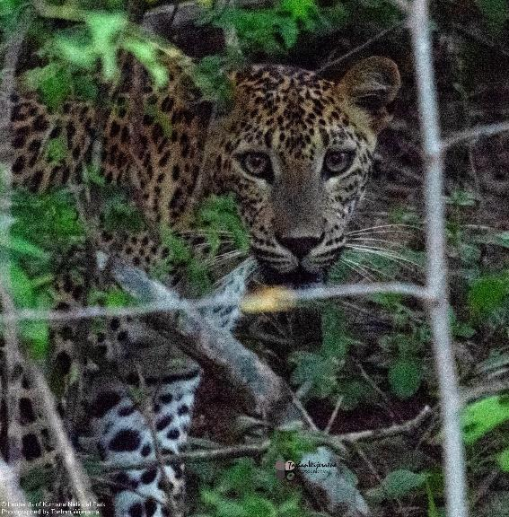 |
| KLF0017 | Mihi | Female | B | 2020-10-02 | 2025-03-14 |  |
| KLF0018 | Meena | Female | B | 2019-06-04 | 2019-06-04 | 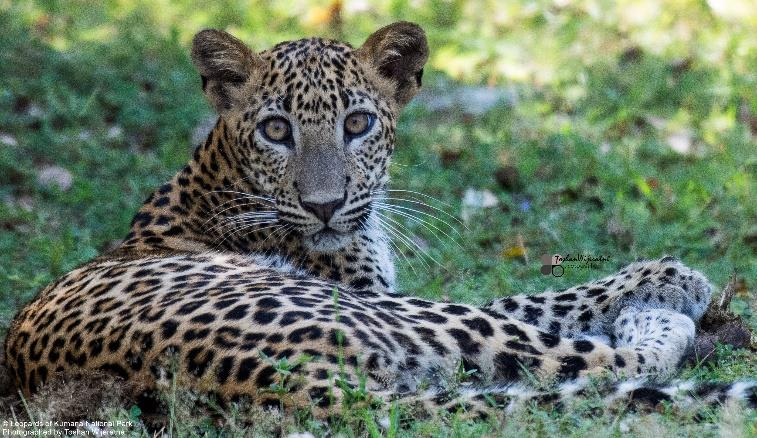 |
| KLF0019 | Chara | Female | A | 2020-12-08 | 2021-02-01 | 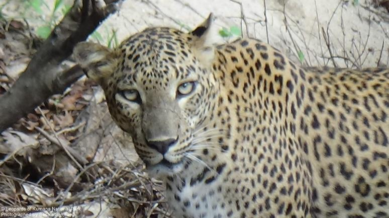 |
| KLF0020 | Sugala | Female | A, B | 2021-01-21 | 2022-10-02 | 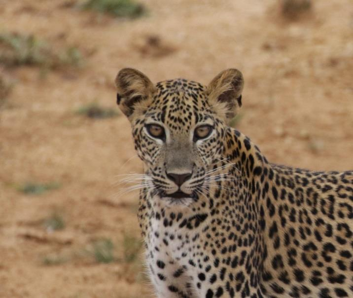 |
| KLF0021 | Suparnaka | Female | A, B | 2021-01-21 | 2025-05-01 |  |
| KLF0022 | Gosha | Female | A | 2021-06-** | 2022-09-14 | 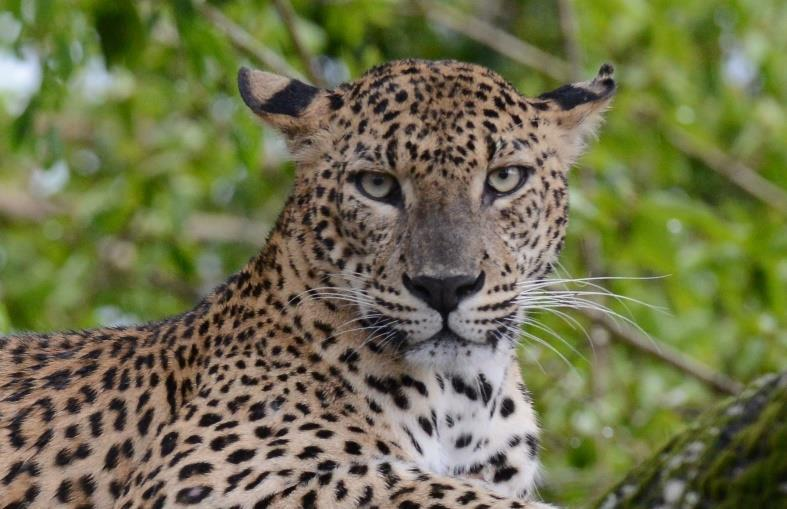 |
| KLF0023 | Kesha | Female | B | 2021-12-25 | 2025-03-26 | 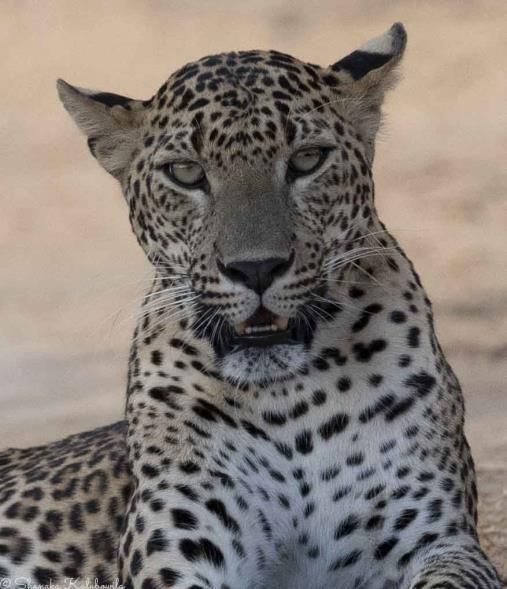 |
| KLF0024 | Agra | Female | B | 2022-01-04 | 2024-06-22 |  |
| KLF0025 | Kati | Female | C | 2022-02-21 | 2022-03-15 |  |
| KLF0026 | Shala | Female | B | 2022-03-20 | 2025-03-24 |  |
| KLF0027 | Dhara | Female | B | 2022-02-15 | 2024-12-23 | 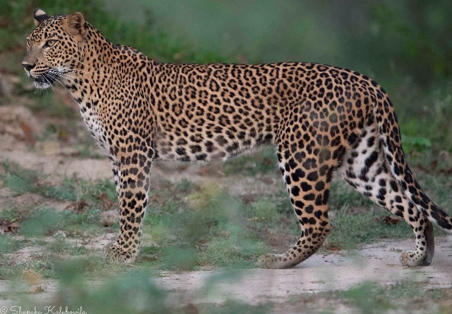 |
| KLF0028 | Abhi | Female | B | 2022-04-19 | 2023-01-14 | 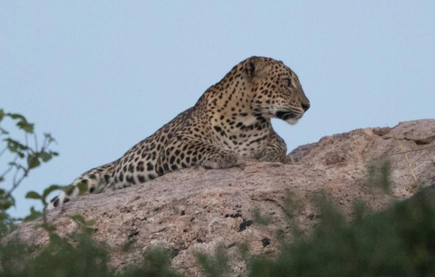 |
| KLF0029 | Olu | Female | B | 2022-04-05 | 2025-05-12 | 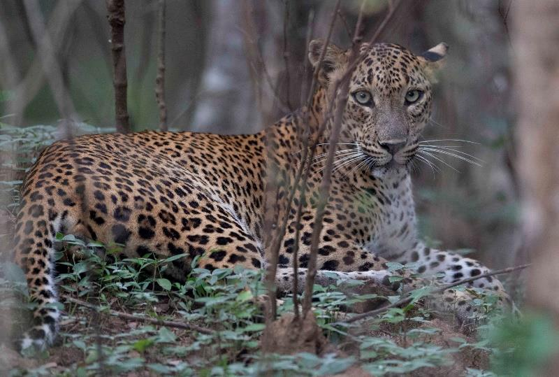 |
| KLF0030 | Sethu | Female | B | 2022-09-23 | 2022-09-23 |  |
| KLF0031 | Anuvi | Female | A | 2022-02-01 | 2025-02-16 |  |
| KLF0032 | Nula | Female | C | 2023-02-16 | 2023-02-16 | 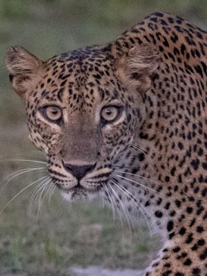 |
| KLF0033 | Avi | Female | A, B | 2022-02-01 | 2024-09-30 |  |
| KLF0034 | Arundi | Female | B | 2023-05-21 | 2025-05-06 | 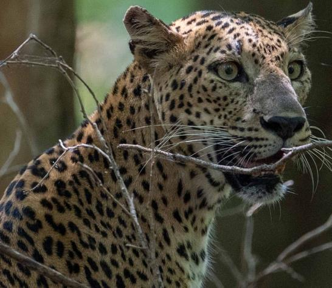 |
| KLF0035 | Nelum | Female | B | 2022-04-05 | 2023-06-20 | 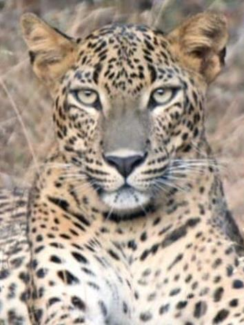 |
| KLF0036 | Soba | Female | A | 2021-09-19 | 2025-05-05 |  |
| KLF0037 | Maala | Female | A | 2023-03-06 | 2024-02-11 |  |
| KLF0038 | Bhagi | Female | A | 2024-03-08 | 2024-06-18 | 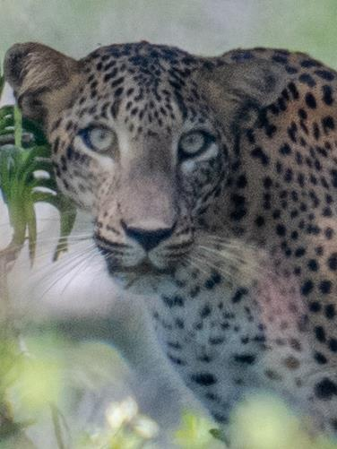 |
| KLF0039 | Nadi | Female | B | 2024-04-22 | 2024-04-22 | 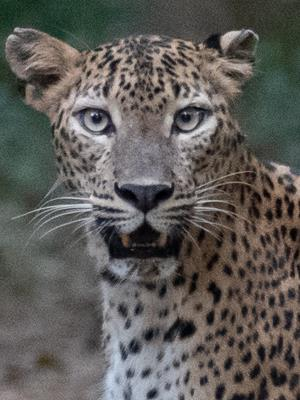 |
| KLF0040 | Seetha | Female | A | 2023-02-09 | 2025-04-16 | 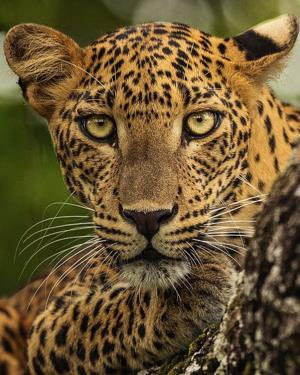 |
| KLF0041 | Aarya | Female | A, B | 2023-09-17 | 2024-06-02 | 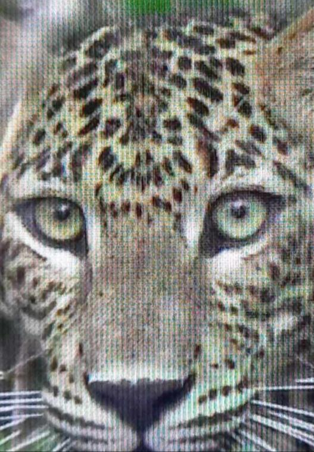 |
| KLF0042 | Meenu | Female | B | 2024-25-03 | 2025-04-22 | 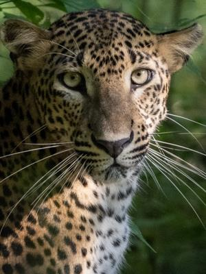 |
| KLF0043 | Nirvi | Female | B | 2024-10-26 | 2025-07-24 | 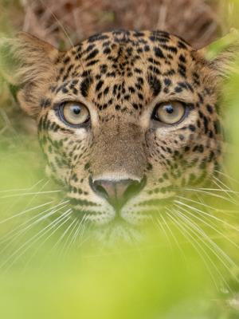 |
| KLF0044 | Rajani | Female | C | 2025-05-20 | 2025-07-26 | 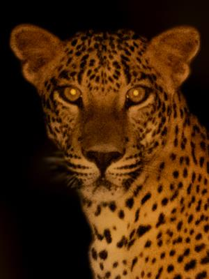 |
| KLF0045 | Ramya | Female | C | 2024-11-06 | 2025-07-24 | 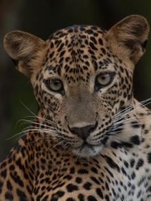 |
| KLM0001 | Hari | Male | B | 2020-11-** | 2022-05-19 |  |
| KLM0002 | Baagu | Male | A, C | 2018-07-24 | 2025-04-24 | 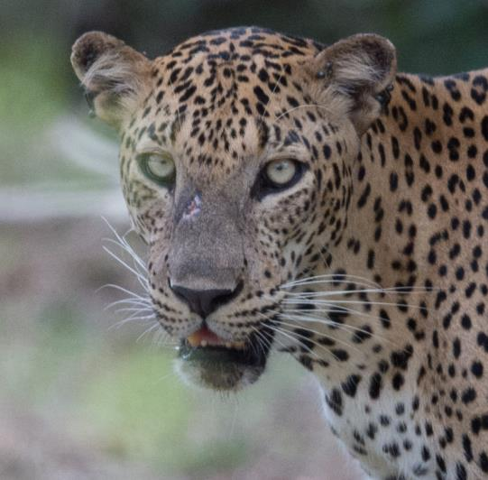 |
| KLM0003 | Sena | Male | A | 2020-07-23 | 2021-12-22 |  |
| KLM0004 | Sella | Male | A | 2020-07-23 | 2021-06-24 |  |
| KLM0005 | Pink Nose | Male | A | 2016-06-25 | 2022-03-28 |  |
| KLM0006 | Giri | Male | A | 2019-09-10 | 2022-02-28 |  |
| KLM0007 | Mudali | Male | A, B, C | 2019-12-16 | 2021-12-29 | 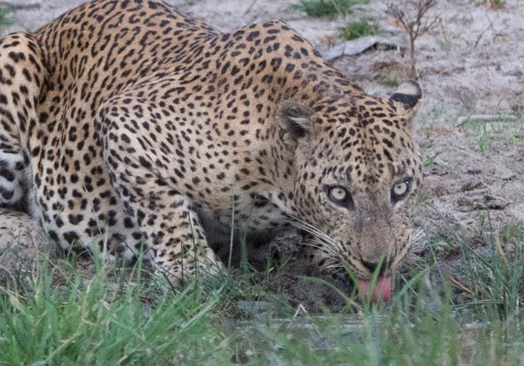 |
| KLM0008 | Rala | Male | A | 2020-10-15 | 2024-10-18 | 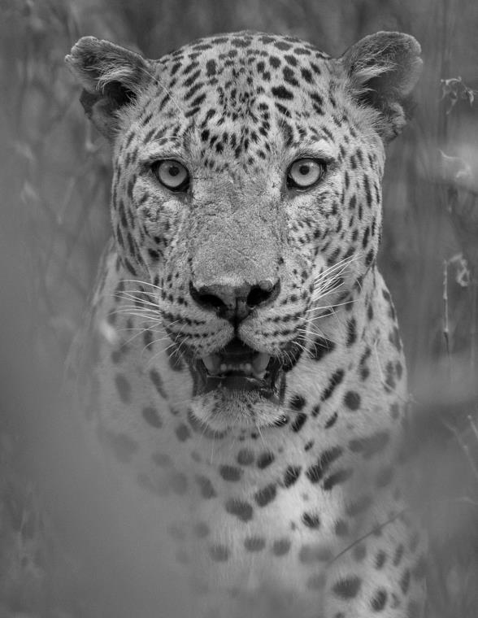 |
| KLM0009 | Sudda | Male | A, B | 2017-03-13 | 2020-10-18 | 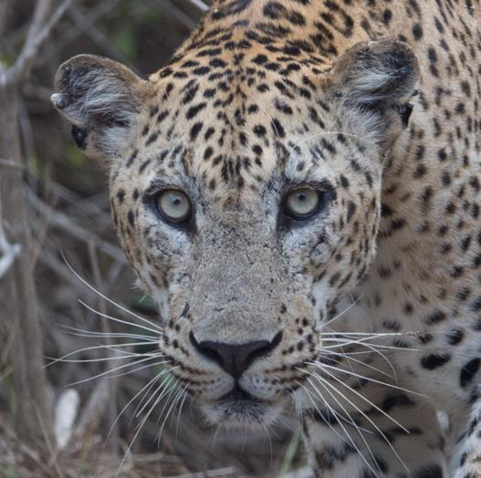 |
| KLM0010 | Geera | Male | A | 2019-09-10 | 2022-01-20 |  |
| KLM0011 | Buti | Male | B | 2018-05-07 | 2020-08-03 | 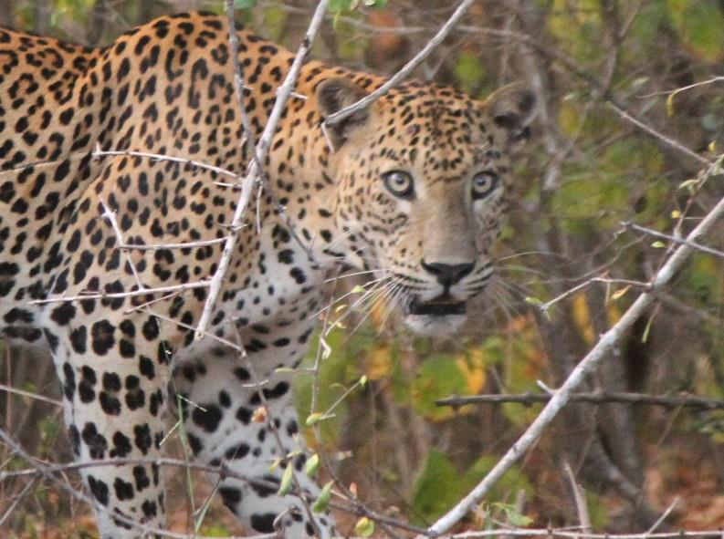 |
| KLM0012 | Agni | Male | B | 2016-07-02 | 2023-06-27 |  |
| KLM0013 | Uti | Male | A | 2019-03-** | 2025-04-30 | 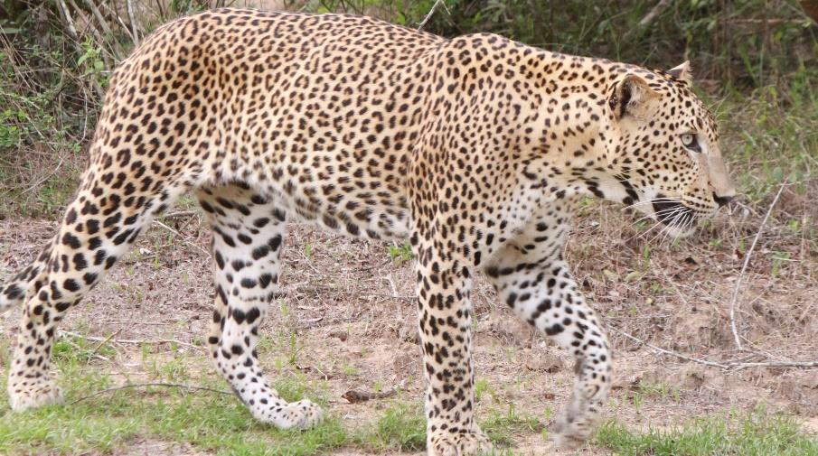 |
| KLM0014 | Mitra | Male | B | 2019-03-18 | 2019-09-04 |  |
| KLM0015 | Sera | Male | B | 2018-07-29 | 2024-06-20 | 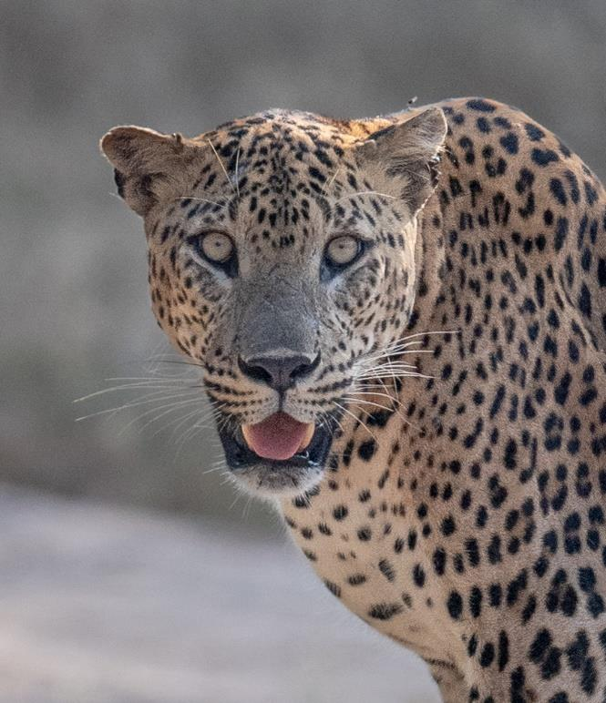 |
| KLM0016 | Maha | Male | A, B | 2020-03-15 | 2025-03-23 |  |
| KLM0017 | Rohaka | Male | B | 2021-08-** | 2024-07-04 |  |
| KLM0018 | Asamana | Male | A, C | 2017-11-18 | 2020-10-16 |  |
| KLM0019 | Sona | Male | B | 2021-10-09 | 2023-04-09 |  |
| KLM0020 | Abaya | Male | C | 2021-12-24 | 2021-12-24 | 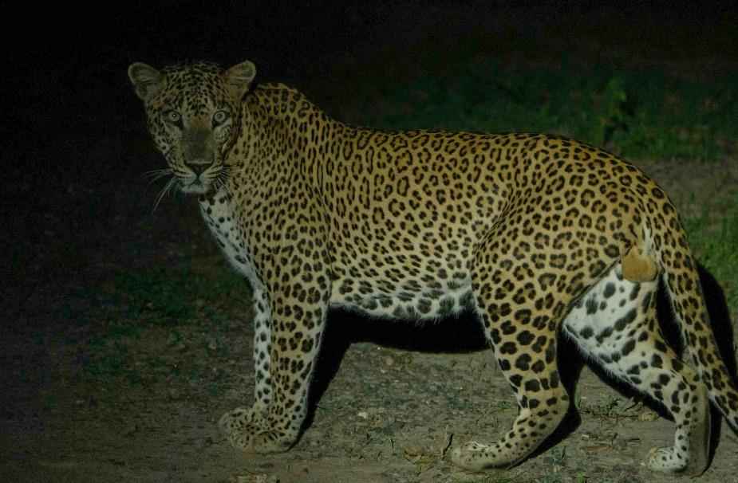 |
| KLM0021 | Wikra | Male | B | 2022-02-28 | 2025-04-16 |  |
| KLM0022 | Andha | Male | A, B | 2022-02-09 | 2025-03-16 | 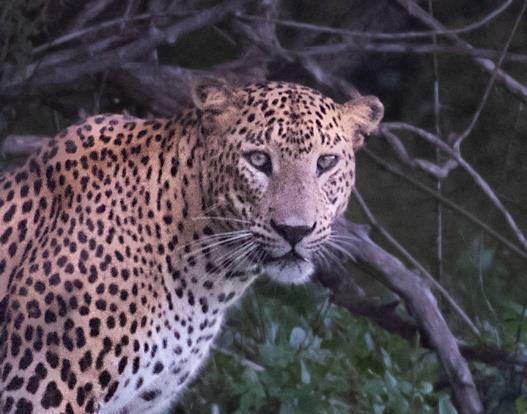 |
| KLM0023 | Seenu | Male | C | 2022-03-12 | 2022-03-12 |  |
| KLM0024 | Mula | Male | B | 2022-02-09 | 2022-02-09 | 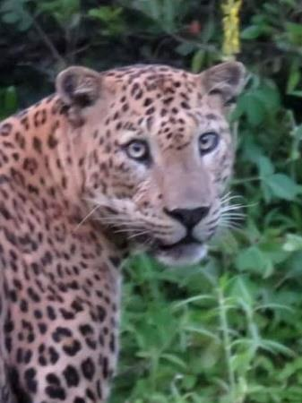 |
| KLM0025 | Kubhira | Male | B | 2022-04-17 | 2023-07-30 |  |
| KLM0026 | Bucket | Male | A | 2024-01-24 | 2024-02-28 |  |
| KLM0027 | Chandra | Male | B | 2021-11-13 | 2023-08-14 | 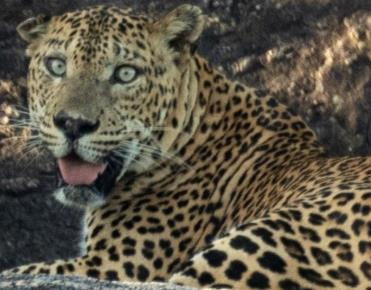 |
| KLM0028 | Chandu | Male | B | 2022-06-22 | 2023-11-26 |  |
| KLM0029 | Rana | Male | A | 2022-10-29 | 2024-10-20 | 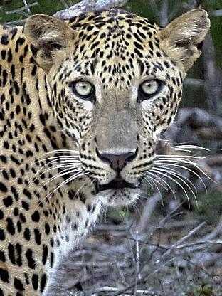 |
| KLM0030 | Theja | Male | C | 2023-03-10 | 2023-03-10 |  |
| KLM0031 | Ritta | Male | B | 2022-06-13 | 2025-04-28 | 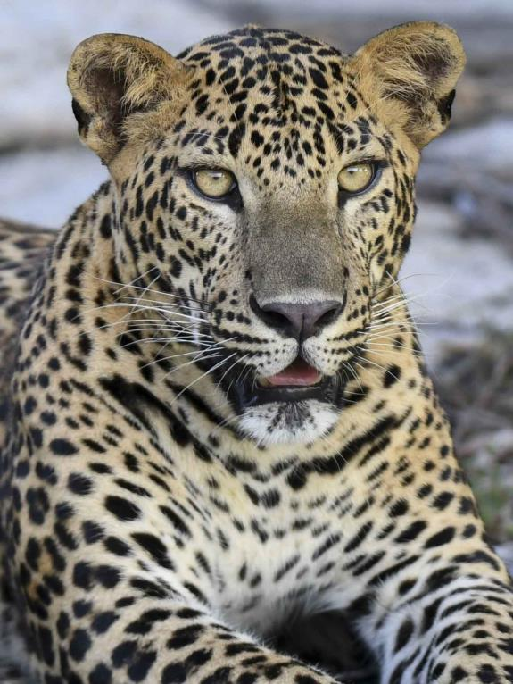 |
| KLM0032 | Naga | Male | A | 2023-04-24 | 2023-04-24 |  |
| KLM0033 | Nandi | Male | B | 2023-04-25 | 2025-05-06 | 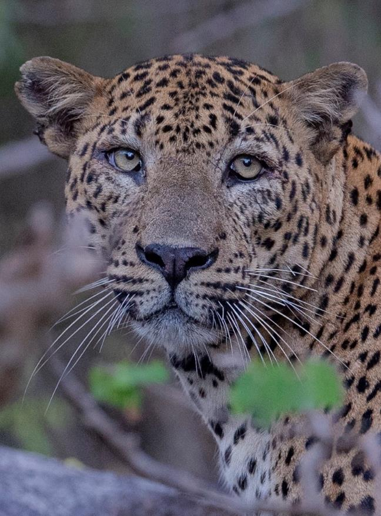 |
| KLM0034 | Jaya | Male | A, B | 2022-10-17 | 2025-04-22 | 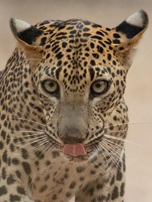 |
| KLM0035 | Alpha | Male | B | 2023-01-26 | 2024-11-13 |  |
| KLM0036 | Nero | Male | B | 2023-09-29 | 2025-03-25 | 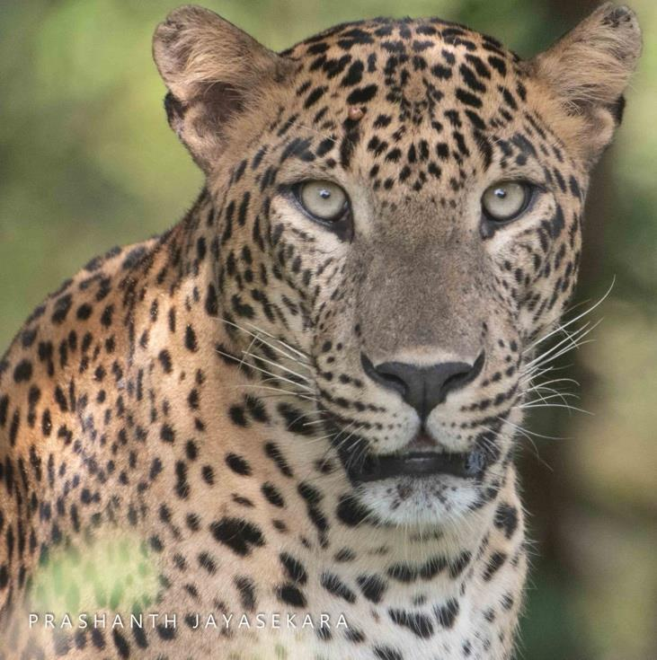 |
| KLM0037 | Raava | Male | A, B | 2024-06-23 | 2025-12-09 |  |
| KLM0038 | OB | Male | A, B | 2024-03-08 | 2025-04-24 | 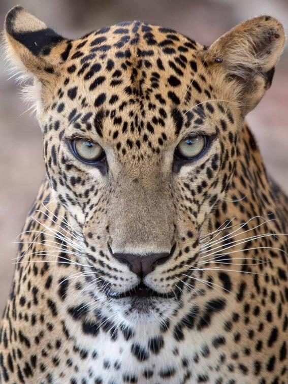 |
| KLM0039 | Rivi | Male | B | 2024-03-07 | 2025-03-26 | 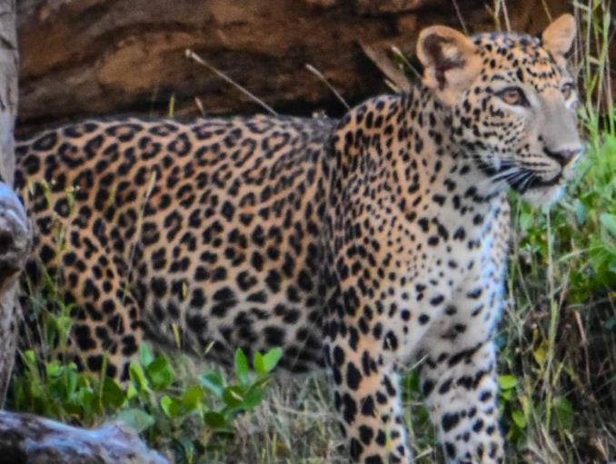 |
| KLM0040 | Veera | Male | B | 2024-12-07 | 2025-04-16 | 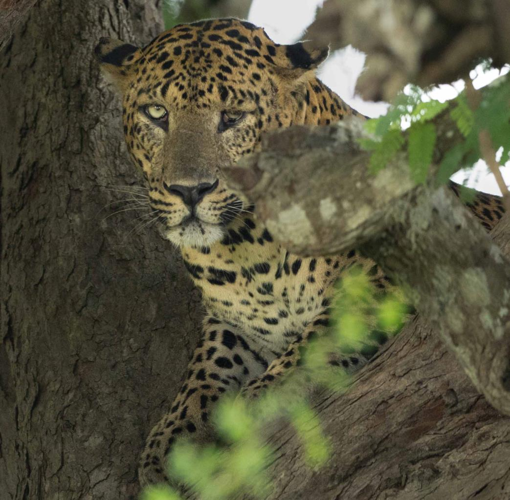 |
| KLM0041 | Soorya | Male | B | 2024-07-31 | 2025-04-26 |  |
| KLM0042 | Raghu | Male | B | 2024-11-06 | 2025-07-24 |  |
| KLM0043 | Sudu Mahaththaya | Male | A, B | 2024-07-28 | 2024-07-28 | 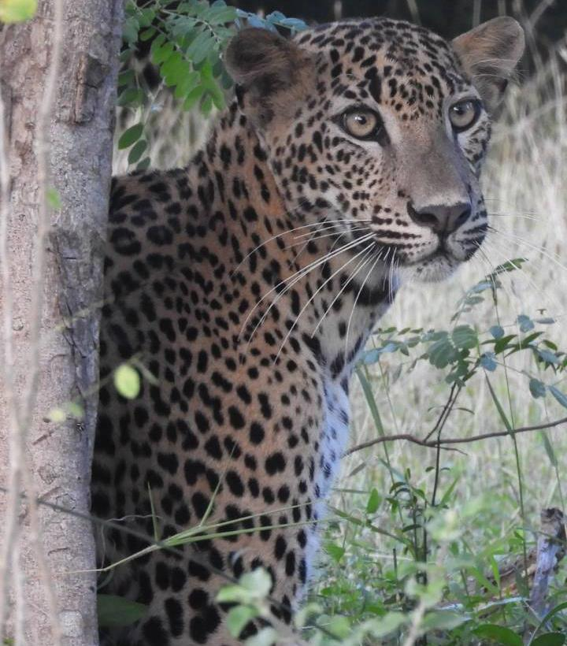 |
