# lk_leopards

Catalogue of leopards observed in Kumana National Park, Sri Lanka.

## Summary

| Metric | Count |
| --- | --- |
| Total leopards | 88 |
| Males | 43 |
| Females | 45 |
| Zones | A, B, C |

## Leopards

| ID | Name | Gender | Zone(s) | First Seen | Last Seen | Image |
| --- | --- | --- | --- | --- | --- | --- |
| KLF1 | Raani | Female | B | 2019-11-15 | 2023-11-17 | 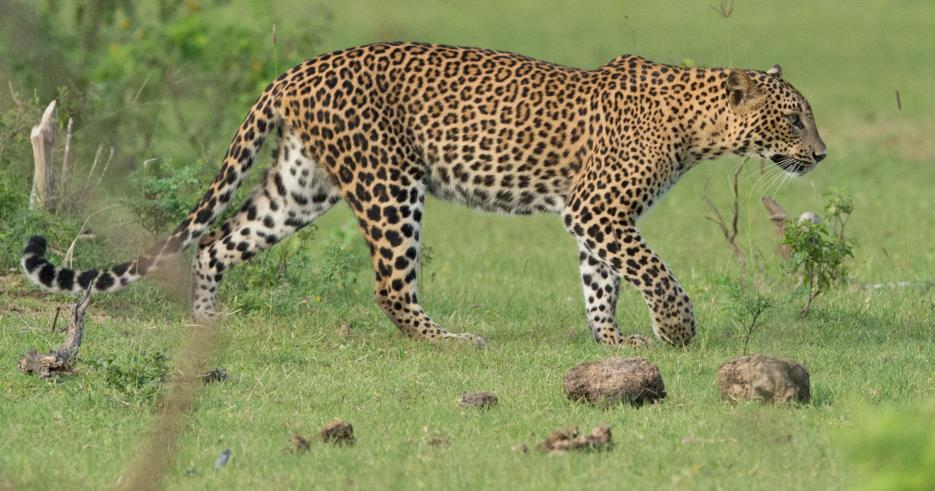 |
| KLF10 | Ridhi | Female | B | 2019-05-01 | 2025-05-06 |  |
| KLF11 | Khema | Female | B | 2019-03-25 | 2024-11-06 | 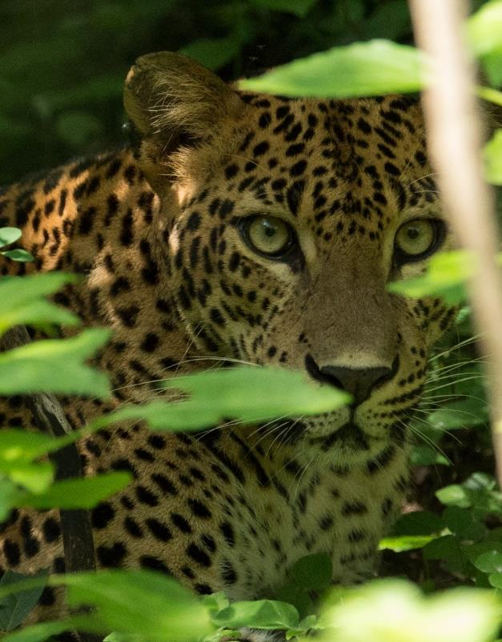 |
| KLF12 | Sobi | Female | B | 2020-08-23 | 2024-10-27 | 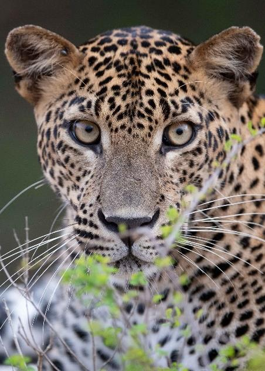 |
| KLF13 | Anodi | Female | B | 2021-06-26 | 2024-09-17 |  |
| KLF14 | Kiso | Female | A | 2017-04-29 | 2017-04-29 |  |
| KLF15 | Bharani | Female | B | 2017-02-01 | 2024-10-23 |  |
| KLF16 | Ramani | Female | B | 2017-02-01 | 2017-11-17 |  |
| KLF17 | Mihi | Female | B | 2020-10-02 | 2025-03-14 | 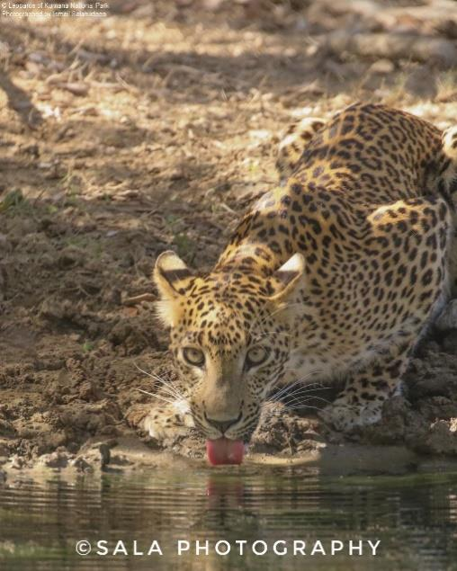 |
| KLF18 | Meena | Female | B | 2019-06-04 | 2019-06-04 |  |
| KLF19 | Chara | Female | A | 2020-12-08 | 2021-02-01 |  |
| KLF2 | Villu | Female | B | 2019-03-25 | 2022-10-09 | 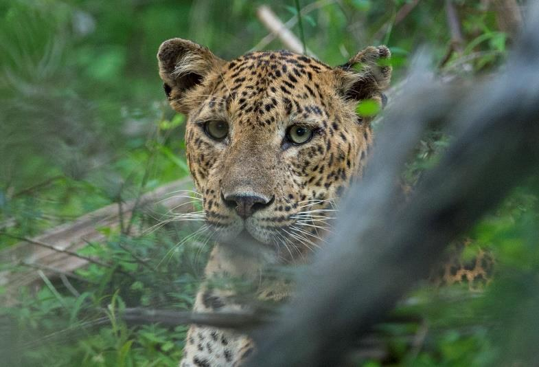 |
| KLF20 | Sugala | Female | A, B | 2021-01-21 | 2022-10-02 |  |
| KLF21 | Suparnaka | Female | A, B | 2021-01-21 | 2025-05-01 | 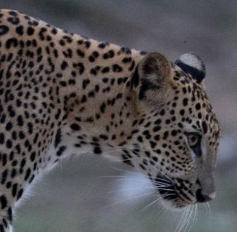 |
| KLF22 | Gosha | Female | A | 2021-06-** | 2022-09-14 |  |
| KLF23 | Kesha | Female | B | 2021-12-25 | 2025-03-26 |  |
| KLF24 | Agra | Female | B | 2022-01-04 | 2024-06-22 | 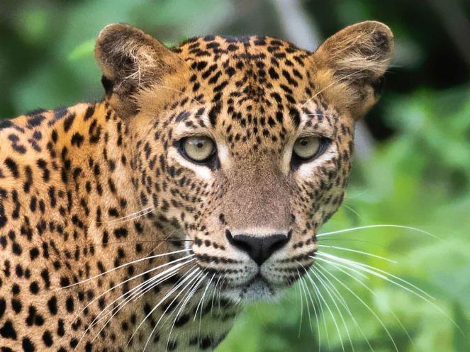 |
| KLF25 | Kati | Female | C | 2022-02-21 | 2022-03-15 | 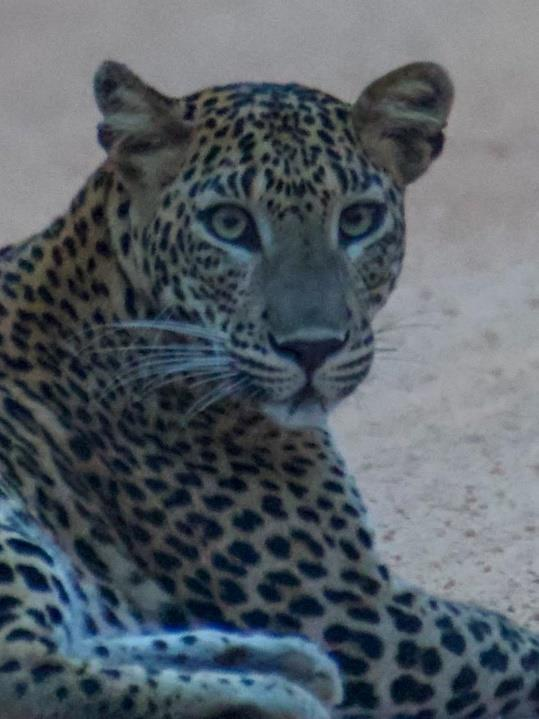 |
| KLF26 | Shala | Female | B | 2022-03-20 | 2025-03-24 | 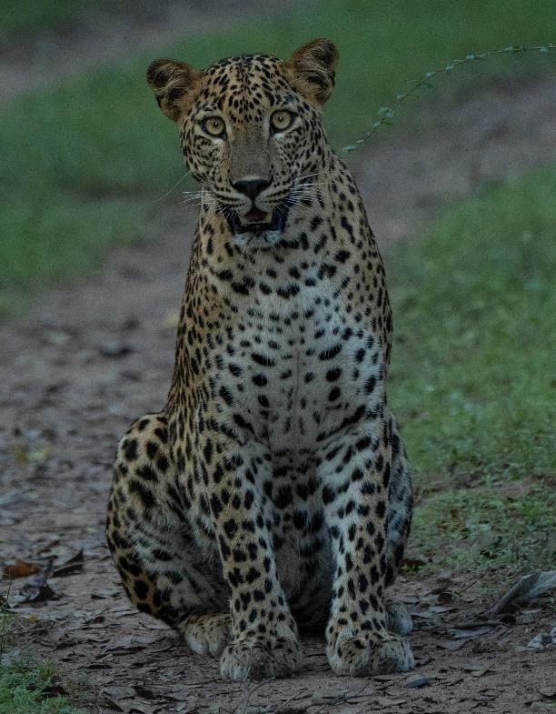 |
| KLF27 | Dhara | Female | B | 2022-02-15 | 2024-12-23 |  |
| KLF28 | Abhi | Female | B | 2022-04-19 | 2023-01-14 |  |
| KLF29 | Olu | Female | B | 2022-04-05 | 2025-05-12 |  |
| KLF3 | Devi | Female | B | 2018-06-24 | 2019-11-17 | 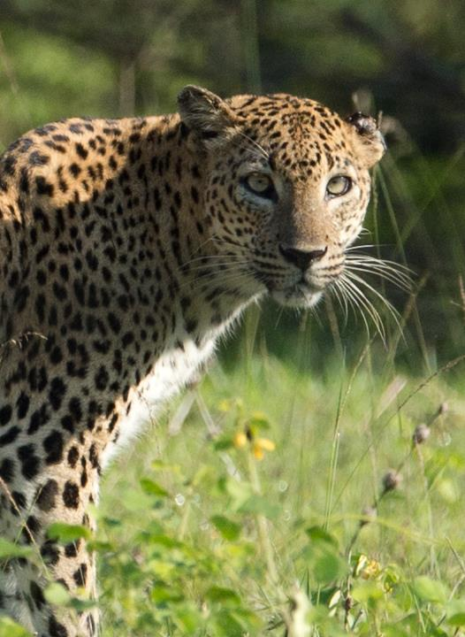 |
| KLF30 | Sethu | Female | B | 2022-09-23 | 2022-09-23 | 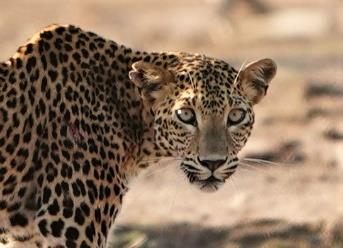 |
| KLF31 | Anuvi | Female | A | 2022-02-01 | 2025-02-16 | 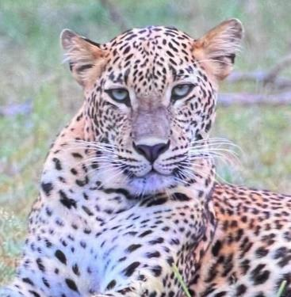 |
| KLF32 | Nula | Female | C | 2023-02-16 | 2023-02-16 |  |
| KLF33 | Avi | Female | A, B | 2022-02-01 | 2024-09-30 | 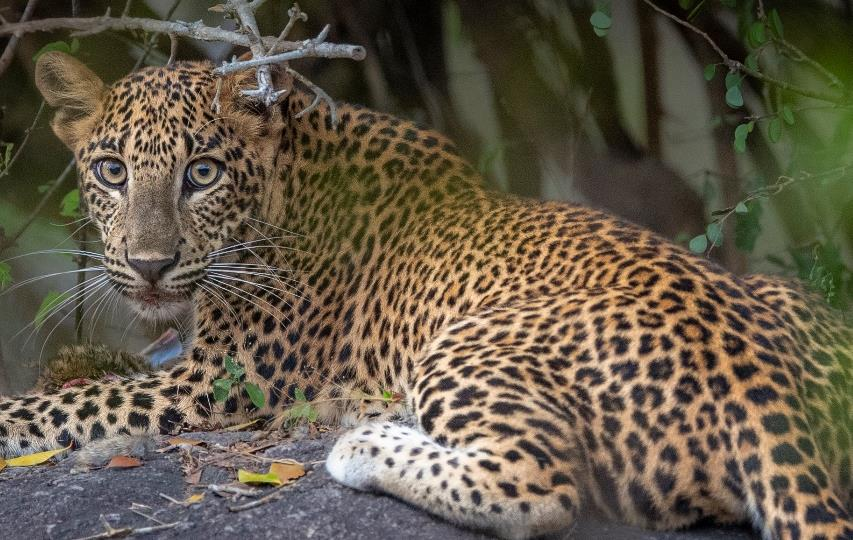 |
| KLF34 | Arundi | Female | B | 2023-05-21 | 2025-05-06 |  |
| KLF35 | Nelum | Female | B | 2022-04-05 | 2023-06-20 |  |
| KLF36 | Soba | Female | A | 2021-09-19 | 2025-05-05 | 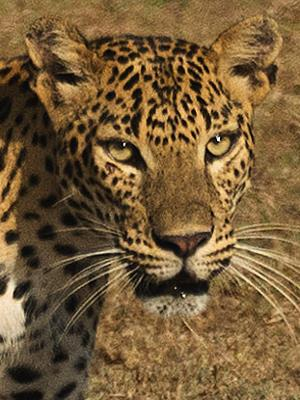 |
| KLF37 | Maala | Female | A | 2023-03-06 | 2024-02-11 | 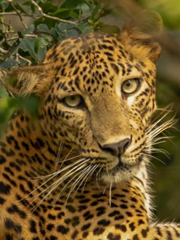 |
| KLF38 | Bhagi | Female | A | 2024-03-08 | 2024-06-18 |  |
| KLF39 | Nadi | Female | B | 2024-04-22 | 2024-04-22 |  |
| KLF4 | Neela | Female | B | 2019-03-25 | 2019-11-17 | 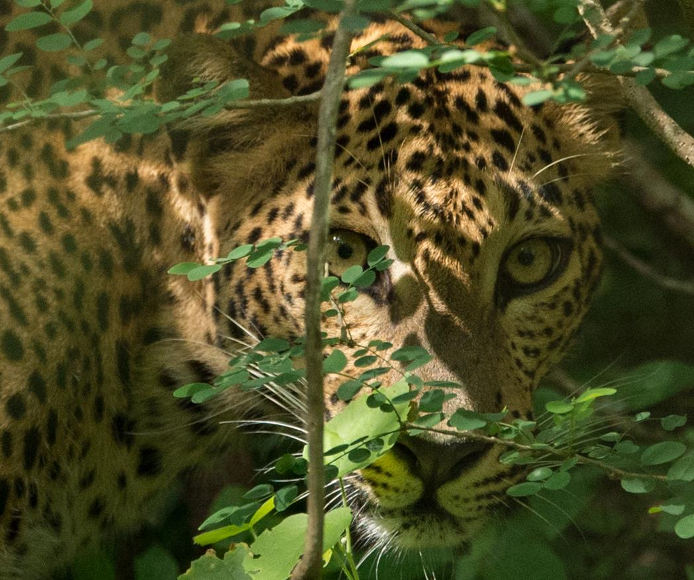 |
| KLF40 | Seetha | Female | A | 2023-02-09 | 2025-04-16 |  |
| KLF41 | Aarya | Female | A, B | 2023-09-17 | 2024-06-02 |  |
| KLF42 | Meenu | Female | B | 2024-25-03 | 2025-04-22 |  |
| KLF43 | Nirvi | Female | B | 2024-10-26 | 2025-07-24 |  |
| KLF44 | Rajani | Female | C | 2025-05-20 | 2025-07-26 |  |
| KLF45 | Ramya | Female | C | 2024-11-06 | 2025-07-24 |  |
| KLF5 | Leela | Female | A | 2014-11-** | 2025-03-22 | 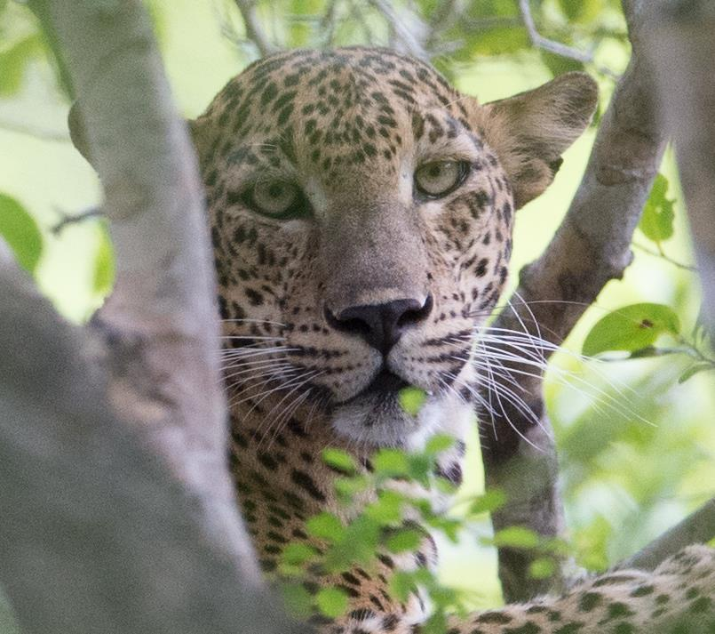 |
| KLF6 | Scent | Female | A | 2020-06-09 | 2025-05-06 | 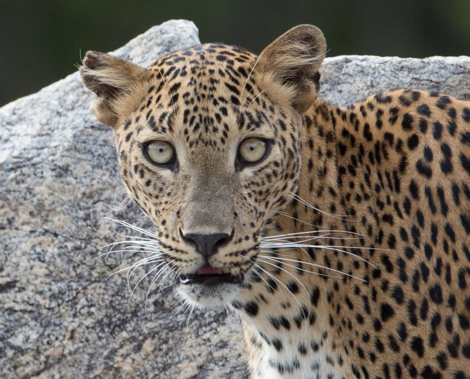 |
| KLF7 | Raki | Female | A, B | 2014-05-17 | 2025-04-18 | 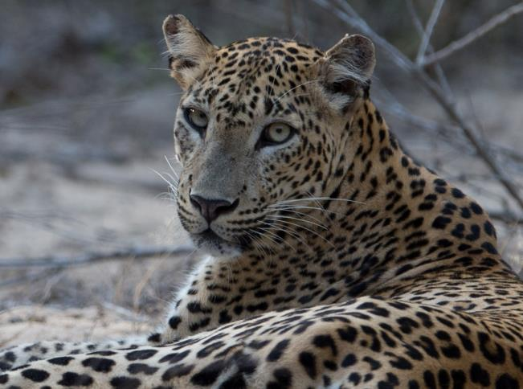 |
| KLF8 | Black Nose | Female | A | 2020 | 2025-05-10 | 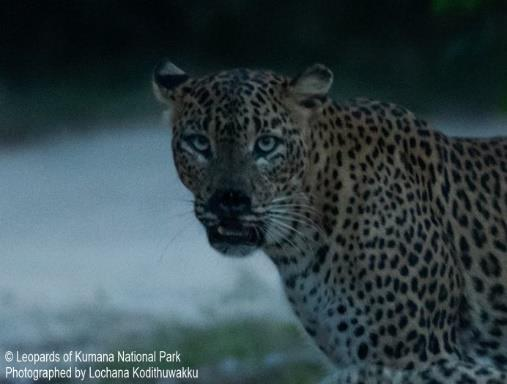 |
| KLF9 | Mitta | Female | A | 2021-01-19 | 2022-06-19 | 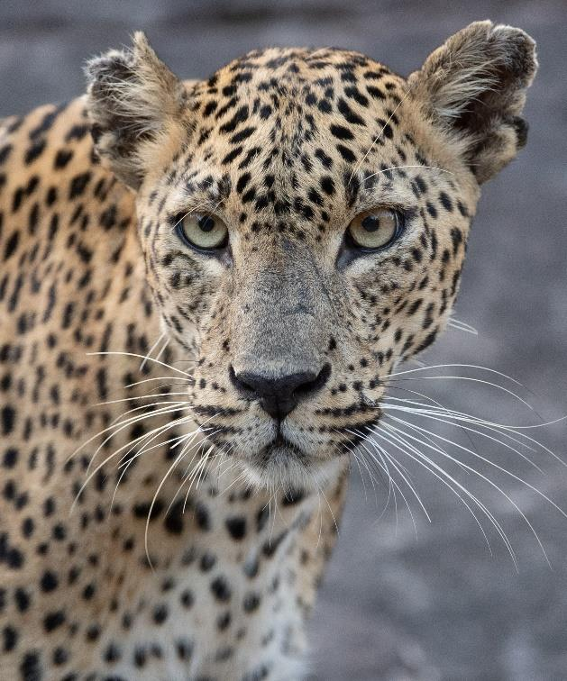 |
| KLM1 | Hari | Male | B | 2020-11-** | 2022-05-19 | 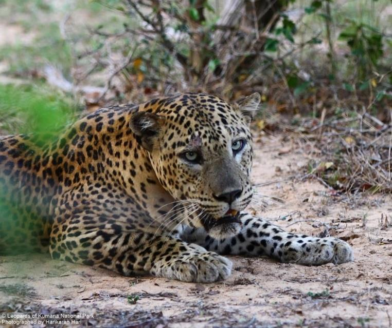 |
| KLM10 | Geera | Male | A | 2019-09-10 | 2022-01-20 | 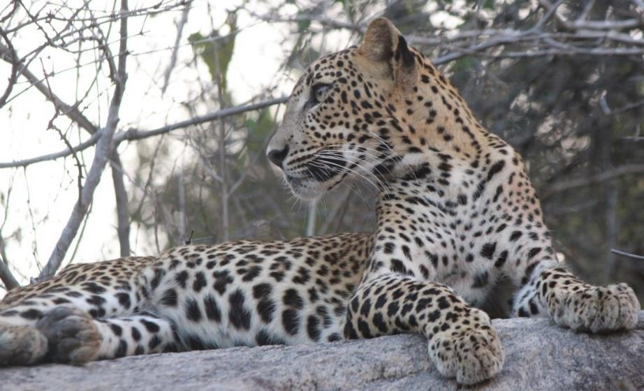 |
| KLM11 | Buti | Male | B | 2018-05-07 | 2020-08-03 |  |
| KLM12 | Agni | Male | B | 2016-07-02 | 2023-06-27 | 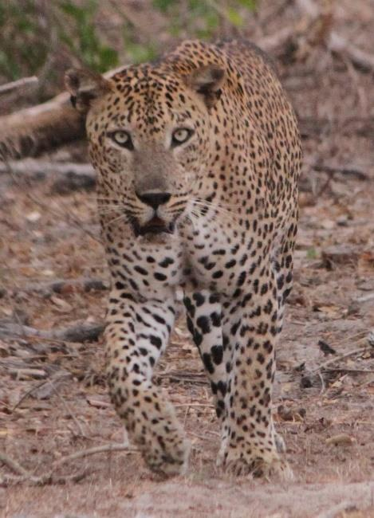 |
| KLM13 | Uti | Male | A | 2019-03-** | 2025-04-30 |  |
| KLM14 | Mitra | Male | B | 2019-03-18 | 2019-09-04 | 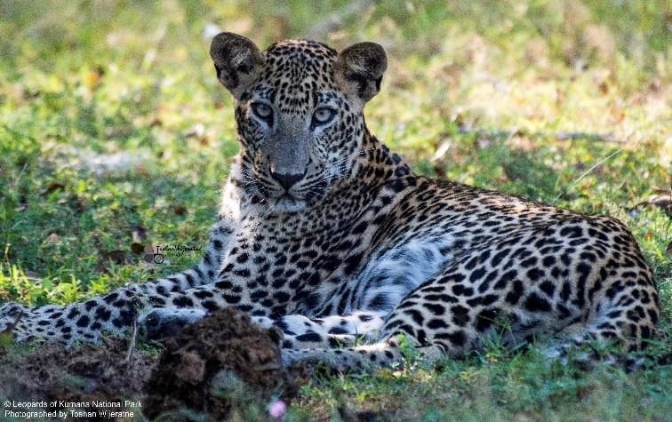 |
| KLM15 | Sera | Male | B | 2018-07-29 | 2024-06-20 |  |
| KLM16 | Maha | Male | A, B | 2020-03-15 | 2025-03-23 | 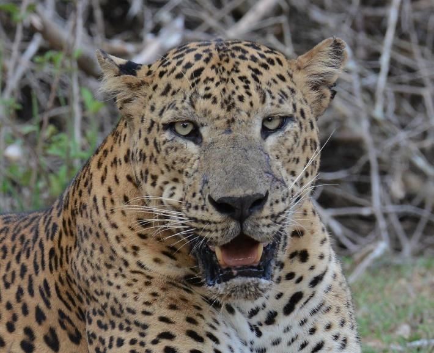 |
| KLM17 | Rohaka | Male | B | 2021-08-** | 2024-07-04 | 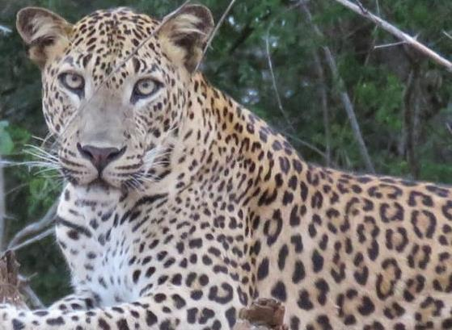 |
| KLM18 | Asamana | Male | A, C | 2017-11-18 | 2020-10-16 | 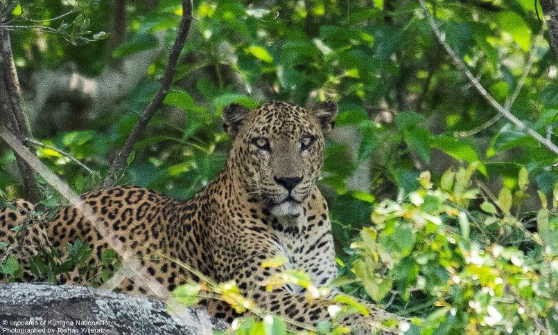 |
| KLM19 | Sona | Male | B | 2021-10-09 | 2023-04-09 | 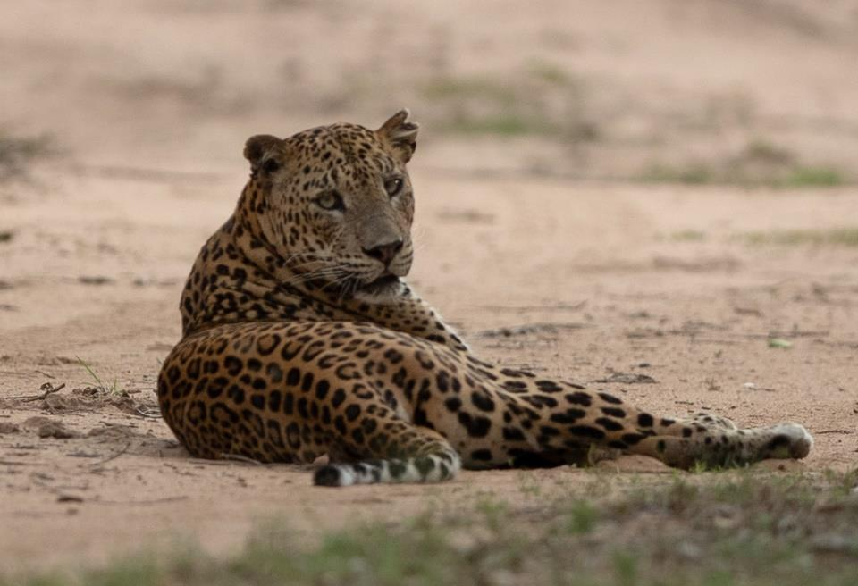 |
| KLM2 | Baagu | Male | A, C | 2018-07-24 | 2025-04-24 |  |
| KLM20 | Abaya | Male | C | 2021-12-24 | 2021-12-24 |  |
| KLM21 | Wikra | Male | B | 2022-02-28 | 2025-04-16 | 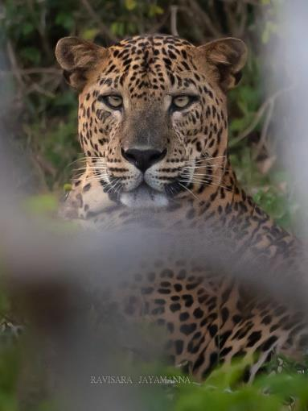 |
| KLM22 | Andha | Male | A, B | 2022-02-09 | 2025-03-16 |  |
| KLM23 | Seenu | Male | C | 2022-03-12 | 2022-03-12 | 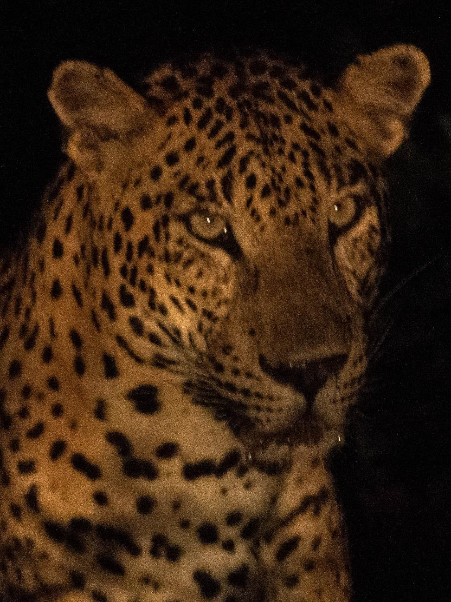 |
| KLM24 | Mula | Male | B | 2022-02-09 | 2022-02-09 |  |
| KLM25 | Kubhira | Male | B | 2022-04-17 | 2023-07-30 | 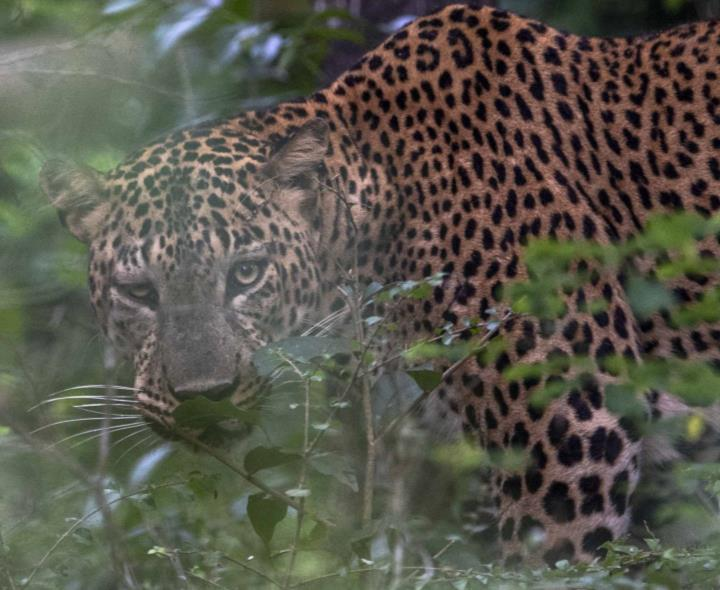 |
| KLM26 | Bucket | Male | A | 2024-01-24 | 2024-02-28 | 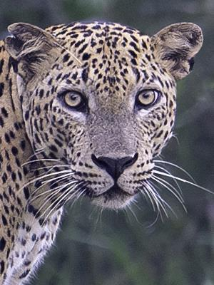 |
| KLM27 | Chandra | Male | B | 2021-11-13 | 2023-08-14 |  |
| KLM28 | Chandu | Male | B | 2022-06-22 | 2023-11-26 | 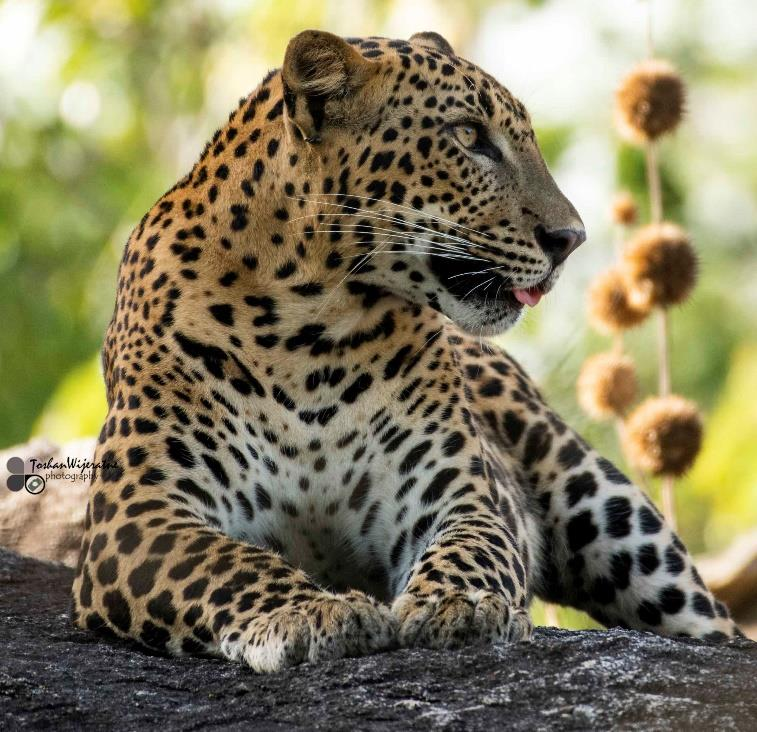 |
| KLM29 | Rana | Male | A | 2022-10-29 | 2024-10-20 |  |
| KLM3 | Sena | Male | A | 2020-07-23 | 2021-12-22 | 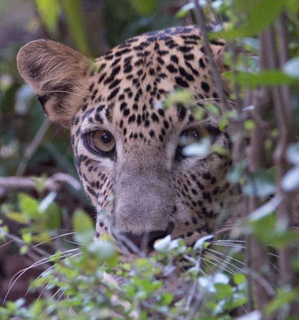 |
| KLM30 | Theja | Male | C | 2023-03-10 | 2023-03-10 | 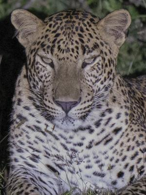 |
| KLM31 | Ritta | Male | B | 2022-06-13 | 2025-04-28 |  |
| KLM32 | Naga | Male | A | 2023-04-24 | 2023-04-24 | 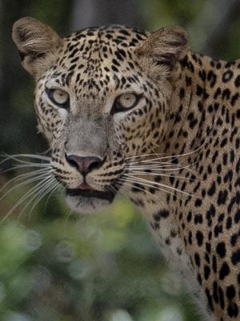 |
| KLM33 | Nandi | Male | B | 2023-04-25 | 2025-05-06 |  |
| KLM34 | Jaya | Male | A, B | 2022-10-17 | 2025-04-22 |  |
| KLM35 | Alpha | Male | B | 2023-01-26 | 2024-11-13 | 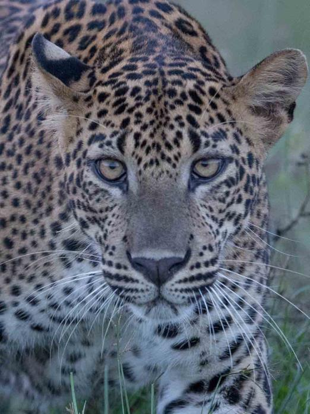 |
| KLM36 | Nero | Male | B | 2023-09-29 | 2025-03-25 |  |
| KLM37 | Raava | Male | A, B | 2024-06-23 | 2025-12-09 | 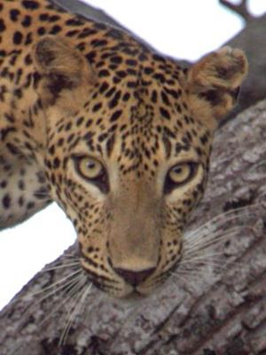 |
| KLM38 | OB | Male | A, B | 2024-03-08 | 2025-04-24 |  |
| KLM39 | Rivi | Male | B | 2024-03-07 | 2025-03-26 |  |
| KLM4 | Sella | Male | A | 2020-07-23 | 2021-06-24 | 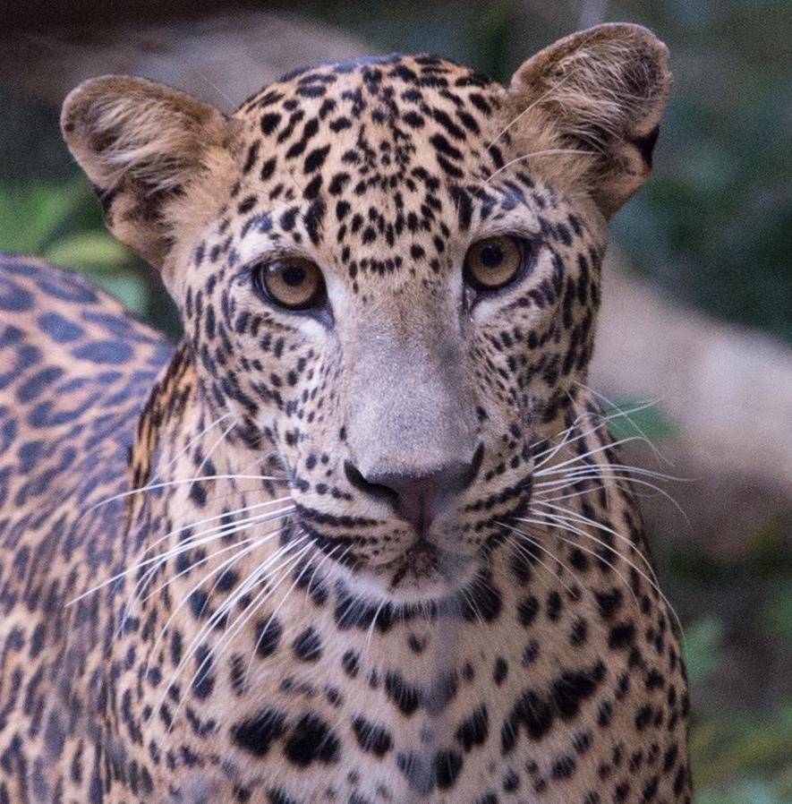 |
| KLM40 | Veera | Male | B | 2024-12-07 | 2025-04-16 |  |
| KLM41 | Soorya | Male | B | 2024-07-31 | 2025-04-26 | 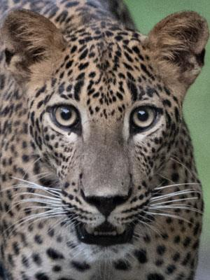 |
| KLM42 | Raghu | Male | B | 2024-11-06 | 2025-07-24 | 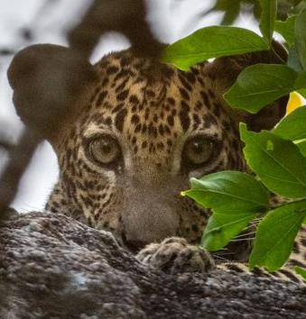 |
| KLM43 | Sudu Mahaththaya | Male | A, B | 2024-07-28 | 2024-07-28 |  |
| KLM5 | Pink Nose | Male | A | 2016-06-25 | 2022-03-28 | 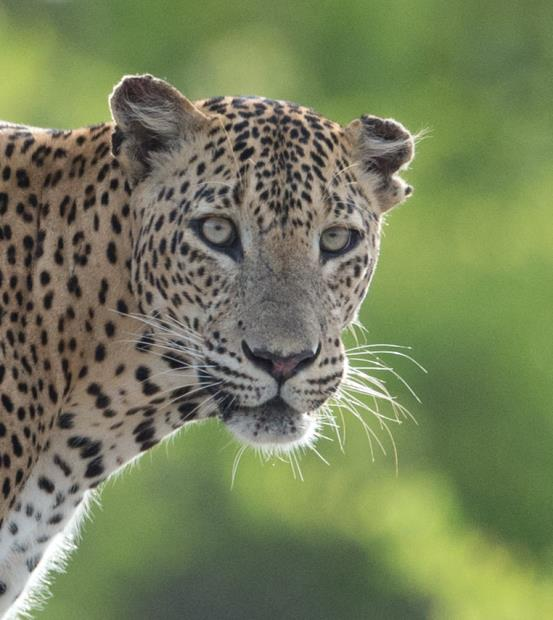 |
| KLM6 | Giri | Male | A | 2019-09-10 | 2022-02-28 | 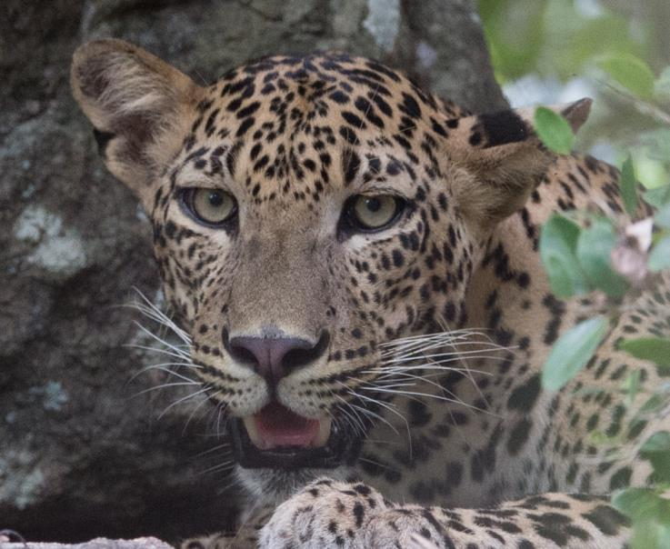 |
| KLM7 | Mudali | Male | A, B, C | 2019-12-16 | 2021-12-29 |  |
| KLM8 | Rala | Male | A | 2020-10-15 | 2024-10-18 |  |
| KLM9 | Sudda | Male | A, B | 2017-03-13 | 2020-10-18 |  |
